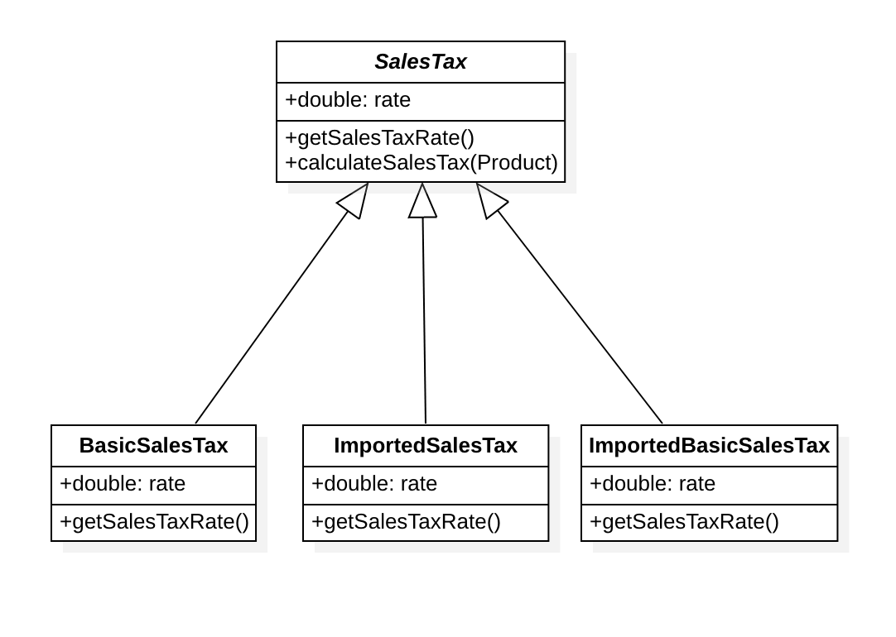

### Problem Two: Sales Taxes

Basic sales tax is applicable at a rate of 10% on all goods, except books, food, and medical products that are exempt. Import duty is an additional sales tax applicable on all imported goods at a rate of 5%, with no exemptions.
 
When I purchase items I receive a receipt which lists the name of all the items and their price (including tax), finishing with the total cost of the items, and the total amounts of sales taxes paid.  The rounding rules for sales tax are that for a tax rate of n%, a shelf price of p contains (np/100 rounded up to the nearest 0.05) amount of sales tax.
 
Write an application that prints out the receipt details for these shopping baskets...

#### EXPECTATIONS
```
Input 1: 
1 book at 12.49
1 music CD at 14.99
1 chocolate bar at 0.85

Output 1:
1 book : 12.49
1 music CD: 16.49
1 chocolate bar: 0.85
Sales Taxes: 1.50
Total: 29.83

Input 2:
1 imported box of chocolates at 10.00
1 imported bottle of perfume at 47.50
 
Output 2:
1 imported box of chocolates: 10.50
1 imported bottle of perfume: 54.65
Sales Taxes: 7.65
Total: 65.15

Input 3:
1 imported bottle of perfume at 27.99
1 bottle of perfume at 18.99
1 packet of headache pills at 9.75
1 box of imported chocolates at 11.25

Output 3:
1 imported bottle of perfume: 32.19
1 bottle of perfume: 20.89
1 packet of headache pills: 9.75
1 imported box of chocolates: 11.85
Sales Taxes: 6.70
Total: 74.68
```

### Solution:
Template design pattern for the above problem is implemented.

### Description of the Template Design Pattern:
Template Method is a behavioral design pattern that defines the skeleton of an algorithm in the superclass.
However, it lets subclasses override required steps of the algorithm without changing its structure.

### Advantages :
The current design pattern follows the OOP principle "inheritance", therefore, allows code-reuse.
Further, it allows Subclasses to implement different behaviors, using method overriding. Thereby avoiding code duplication. 
The general workflow is implemented in abstract class algorithm, and necessary implementations are implemented in subclasses.


### Description
Created an application that prints out the receipt details for shopping baskets based on the sample input above.


### Below are the pre-requisites to run this project. 
* IDE (of Choice like Intellij, Eclipse, STS)
* JDK 8 or later
* Maven

### Steps to Run this project locally
Step 1: clone the above project to IDE of your choice.

Step 2: Start the application by the using the below command. 
		mvn clean install
		Look for build success and all the tests are successful in the console. 

Step 3: Running application from IDE:
		Go to the Main program ReceiptGenerator and right click, run as Java application to see input and output displayed in the console.
		Different inputs are saved in three separate text files, under src/main/resources folder.
		Inputs can also be supplied as arguments to the program.


### Objects & Classes

### Domain Classes:
* Product - Domain class to hold details such as price, description of product, isImported and isExempt
* ShoppingCartItem - Domain class to hold details like Products (Refer to Product domain), Quantity, SalesTaxAmount, amountAfterTax
* ShoppingCart - Domain class to hold details like List of ShoppingCartItem, totalSalesTaxAmount, totalAmount

### Class Diagram



### Acceptance Criteria :
```
Input 1 
1 book at 12.49
1 music CD at 14.99
1 chocolate bar at 0.85

Output 1:
1 book : 12.49
1 music CD: 16.49
1 chocolate bar: 0.85
Sales Taxes: 1.50
Total: 29.83

Input 2:
1 imported box of chocolates at 10.00
1 imported bottle of perfume at 47.50
 
Output 2:
1 imported box of chocolates: 10.50
1 imported bottle of perfume: 54.65
Sales Taxes: 7.65
Total: 65.15

Input 3:
1 imported bottle of perfume at 27.99
1 bottle of perfume at 18.99
1 packet of headache pills at 9.75
1 box of imported chocolates at 11.25

Output 3:
1 imported bottle of perfume: 32.19
1 bottle of perfume: 20.89
1 packet of headache pills: 9.75
1 imported box of chocolates: 11.85
Sales Taxes: 6.70
Total: 74.68
```
Acceptance criteria has passed successfully because the inputs and the outputs displayed in the console are verified. 
Additional passed test cases include testing with different quantities and prices. 

Please see below for an example,
```
Input 4:
1 imported bottle of perfume at 17.99
1 bottle of perfume at 17.99
2 packet of headache pills at 8.75
2 box of imported chocolates at 13.25

Output 4:
1 imported bottle of perfume: 20.69
1 bottle of perfume: 19.79
2 packet of headache pills: 17.50
2 box of imported chocolates: 27.90
Sales Taxes:5.90
Total:85.88
```
